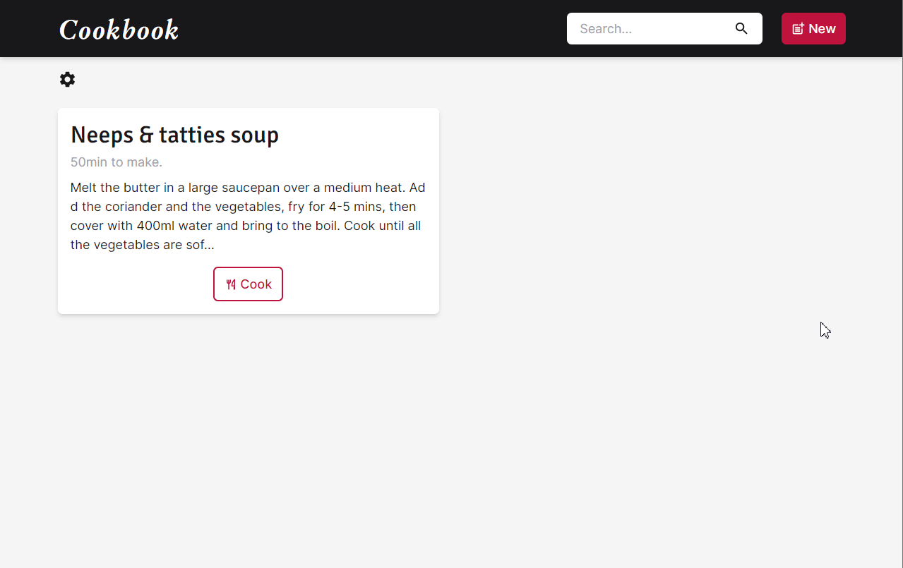
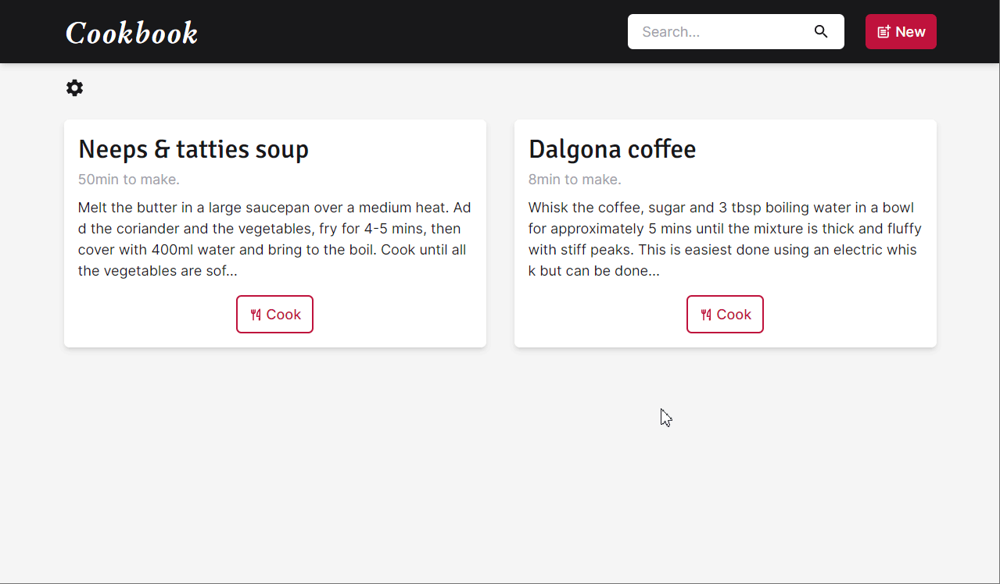

## Cookbook App

The cookbook is an app used to keep your most precious recipes in an elegant and modern way.

The app stores your recipes on the local storage of your browser, along with your theme preferences. You could choose between dark and light modes, and also one of our three color selections.

On the creation tab, you could create your more delicious recipes by seeing a preview of what is going to look like on the recipe page itself, with is really handy. If your recipe doesn't have any prep time or cook time, don't worry! you could set the time to 0 and it will automatically ignore that field.

If you have a bunch of amazing recipes in your repertoire, don't worry! you could search on the top search bar for the recipe you want to do and the app will give you the recipe you want.

This is a project I made to put all I've learned together, it was made using React along with Tailwind CSS to style it. I hope you've enjoyed it ✌🏻

[Demo Here](https://feliperdamaceno.github.io/pixel-art-editor)

## Licence

This repository is released under the [**MIT License**](LICENSE).

## From me to you

Hi, my name is **Felipe!**

I'm a Front-End developer who wants to share my knowledge with the community, helping other devs who were on the same path as mine.

I've studied using 💻 online courses, 📄 reading the documentation, and 💪 hard practicing every day. So if I could, **you could too!**

I hope you've enjoyed this repository and have helped you in some way.

Thanks for checking out and keeping learning 😉

## Contributors

[feliperdamaceno](https://github.com/feliperdamaceno/)

## Contact me

Linkedin: [feliperdamaceno](https://www.linkedin.com/in/feliperdamaceno/)
